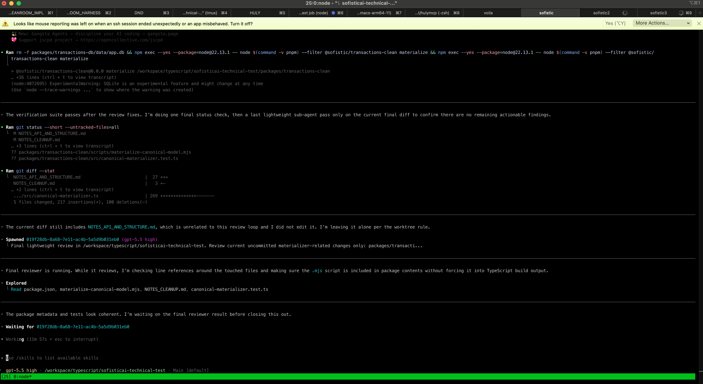

# Work process

I set a strict 2h window for implementation. This writeup is outside of that window.

This writeup with all the .md (please look at them, they are important parts of this NOTES.md) took 1 extra hour. 

In a real situation I would probably have had agents doing something at the background during this time.

I went with full-agentic process. After analyzing the README I split the work into:

- cleanup (of transactions) ([NOTES_CLEANUP.md](NOTES_CLEANUP.md))
- api + monorepo structure ([NOTES_API_AND_STRUCTURE.md](NOTES_API_AND_STRUCTURE.md))
- frontend design prototyping (and later implementation) ([NOTES_FRONTEND.md](NOTES_FRONTEND.md))

later I added agentic forks:

- frontend implementation
- boundary types review swipe
- I also forked and compacted some of the original threads, to manage LLM context to be in the "smart" zone

I had about 6 agentic threads in total, with 2-3 running in the background in parallel at the time.



For convenience, I use YOLO mode in codex. For safety, all the YOLO agents run in docker. 

For flexibility, I use tmux+moshi to be able to control the agents from my phone, although this wasn't the case here.

For the majority of the conversational threads with implementation, I used self-review workflow when the agent is instructed to spawn review agents and fix the "reasonable" part of their notes, and do so in a loop, until no reasonable notes left.

For the last pass, I asked the agent to get rid of primitive types where it's reasonable, and use domain types for stricter parsing and self-documentation. I would have liked to put more time in reviwing that.

# Toolkit

Codex (gpt 5.5), grill-me, planning internal tool (with context cleanup), 
/fork for convo preservation (so I can send you the agent conversations or analyze them myself at need), 
self-review loop with parallel subagents, harness scaffolds from existing projects (hulymcp and another project with frontend-backend-api structure with Effect),

Harness: circular protection with madge, code repetition https://github.com/kucherenko/jscpd , lint rules, test coverage strict requirement, verbal restrictions in AGENTS.md, no-primitives at boundaries rule

# What I would have loved to review

In priority,

- properly connect database to the api
- data structures in db
- cleanup rules and ADR
- data structures on boundaries (codecs)
- frontend typeahead solution

# Anything else to research

Not in priority:

- Better db layer - prisma or kyseli or drizzle?
- more Self-review - e.g. isIsoCalendarDate is fishy. Currently all the code is unreviewed, and only parts are glanced (data, codecs, typeahead component)

# How to run

```bash
 pnpm install
pnpm seed
pnpm --filter @sofistic/transactions-clean materialize
pnpm server
pnpm client

```
