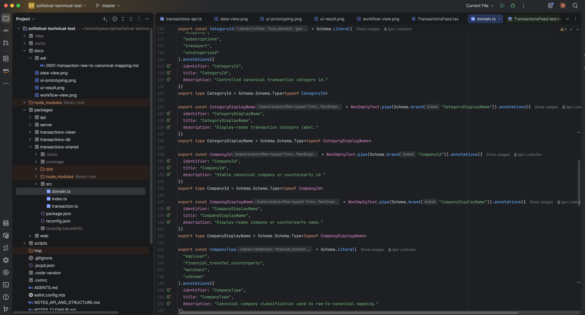

# API and Structure Notes

This is probably the simplest stage, because with LLMs I just pull my current scaffolding into the repo.

I didn't go with Nuxt because I have confidence Codex would manage my scaffolding with no surprises in 2hours window. I have no idea about its quirks or their absence when it comes to Nuxt.

Otherwise I would have gone with Nuxt because of the team's experience with it.

## general api structure notes

I always go by-default with strict codecs (two-way isomorphic parsers) at boundaries, e.g. APIs and DBs.

Typescript allows us to share schemas so a separate package for schemas it is: packages/api/src/schemas.ts

Important note that if I need e.g. to implement DB boundaries, or external APIs etc, the schemas would sit in the proper feature packages, in the best vertical-slice architecture way.

Along with the rest model/view/controller concerns or whatever the project architecture dictates: I prefer technical structure serving features and domain concepts, not vice versa.

## Split

- `api` for the public HTTP interface.
- `web` for the React client.
- `server` for HTTP wiring.
- `transactions-shared` for internal transaction data structures.
- `transactions-clean` for cleanup, dedupe, normalization.
- `transactions-db` for storage concerns.

For the feed api call, I deliberately kept the main endpoint to serve already-cleaned-up data. 

I assume the frontend doesn't care about provenance.

I used the grill-me skill for reflecting llm with api decisions. Important ones:

- Money are bigint strings in json layer, and strictly integers in any code
- Currency should be a schema-defined union
- Dates should be date-only ISO strings (I initially wanted full ISO but looked at the data and decided for date-only)
- Search should use explicit structured query params (instead of q=)
- Pagination is intentionally excluded for the MVP purpos

