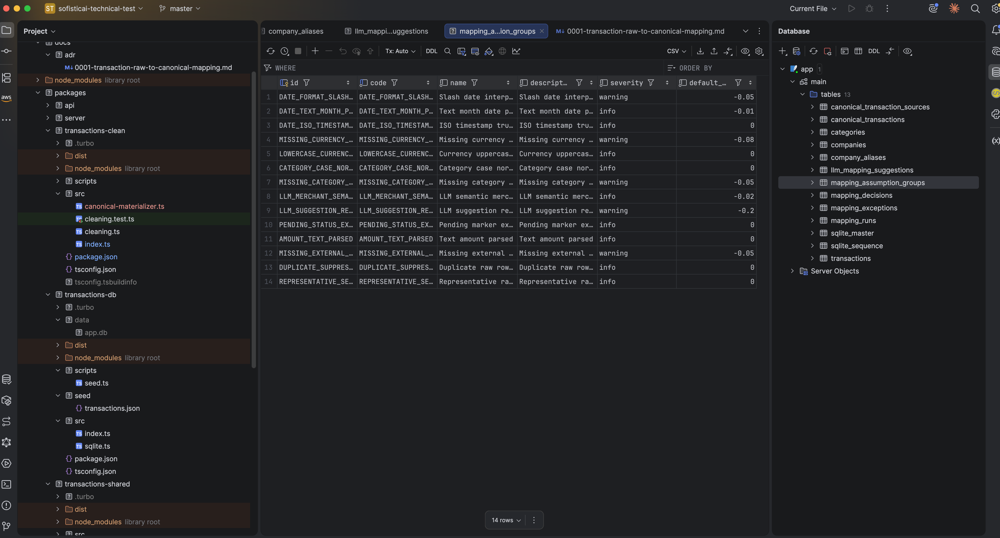

# Cleanup

For cleanup, I decided that keeping the original table is the way. We have provenance and I also don't know whether this table is a result from external system we have no control over.

The original table has to be cleaned up by mapping it into our internal model. 

[0001-transaction-raw-to-canonical-mapping.md](docs/adr/0001-transaction-raw-to-canonical-mapping.md) describes the mapping workflow rules.

I came up to this ADR through planning with (an older version of) https://github.com/mattpocock/skills/blob/main/skills/engineering/grill-with-docs/SKILL.md skill, prompting the agent to ask me questions.

This ADR is an example of specs that we'd refine and use in whatever system will stand between dirty data and our database,

e.g. CDC => Kafka => Flink, or **any variation of that, because technology doesn't matter at this stage** where CDC would e.g. come from the original transactions table, Kafka serve transport protocol, and Flink consist of mapping business rules.

I don't know whether human involvement would be needed, but I added that as an option through llm_mapping_suggestions table.

Companies are normalized into companies and linked to their provenance with company_aliases.

There are also reasons of mapping decisions materialized in groups table. 

The final result is a canonical transactions table that (supposed to be) served to the API.

## Omissions

### API connection

I haven't actually connected the database to the API. 

I noticed that there's a parallel llm-generated logic listCleanTransactions that is calculated in realtime during the request that I missed. 

Because I don't want to do any commits over 2hr window, I'm leaving it as-is.

### Flow

Purposely, I decided against writing a programmatic flow that would clean up the data.

That would probably involve LLM calls, strict business rule structure, probably human in the loop with dashboard etc.

Instead, I asked the agent to simulate such a process by reading the ADR and fill the table manually.

Then I asked it to hardcode the seed script that would reproduce its thinking process and fill the .db file with cleaned up data.

```bash
pnpm seed # only the original transactions
pnpm --filter @sofistic/transactions-clean materialize # mapping run
```

Reviewing agentic work, I look at the data first. I didn't have enough time to refine the data properly, so it may have insufficiencies.

