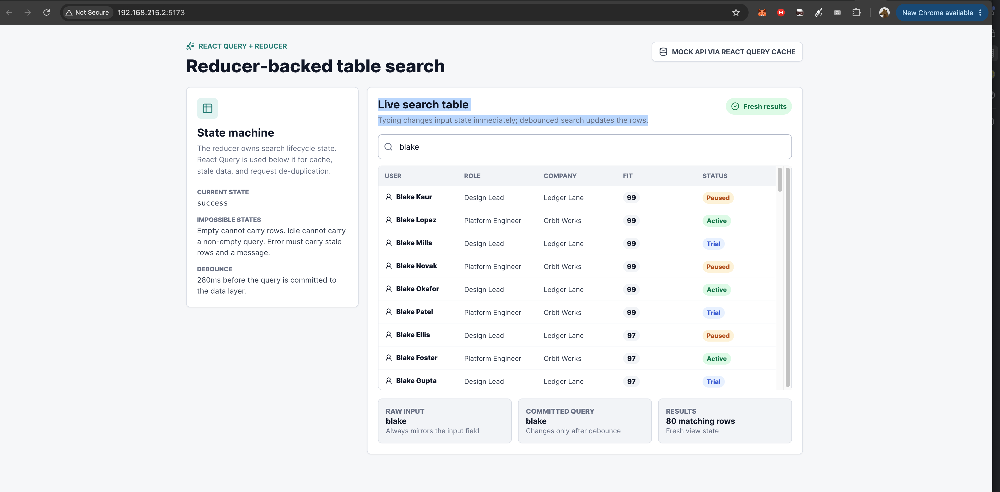
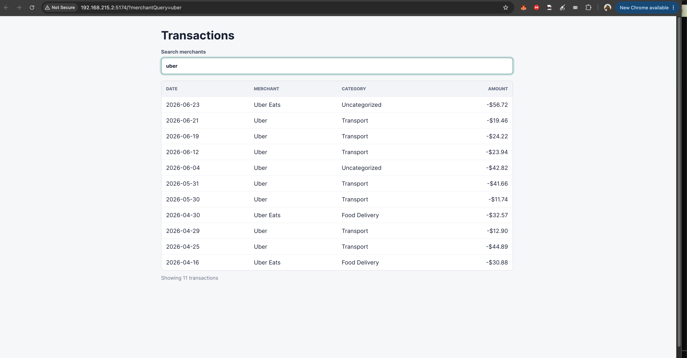

# Frontend Notes

## Library Decisions

I went for quick research of typeahead libs with the agent. For each and some combinations, I asked it to create mock ui components in parallel in worktrees.

I went the wrong path of `react-select` and seemingly `downshift` then settled down at custom-written reducer in useContext that explicitly materializes the api loading, debounce and the rest of state combinatorics,
and connects with the react-query, nuqs and app code through a hook.

I would have liked to put more time into its review and refinement but didn't have enough time in 2h window.

I would have liked to also put more time in library research - maybe there are better solutions.

I decided against, but thought about, any virtualization of the list of results or pagination.

Prototyping session glance: 

Result:

